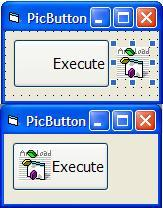



## XP CommandButton with Picture

### Description

Another Method of putting a picture in a command button with style set to normal (to preserve XP skin-ability). This is in response to a posting by Abílio Rodrigues "A Command Button with Icon (XP)" at http://www.planet-source-code.com/vb/scripts/showcode.asp?txtCodeId=57116&lngWId=1. I tried to post it as a comment on his posting, but received an email saying it did not work. So, it's easier to just upload it as a zip. This works for XP, but might work in other OS's.
 
### More Info
 
separate command button and picture with an icon to put in the button.

I use vb 6.0 with WinXP SP2.

an XP command button with a picture.

may lose the picture sometimes, but i'm not sure...

             |
---                |---
**Submitted On**   |2004-11-08 07:24:00
**By**             |[Tom Pydeski](https://github.com/Planet-Source-Code/PSCIndex/blob/master/ByAuthor/tom-pydeski.md)
**Level**          |Beginner
**User Rating**    |3.5 (14 globes from 4 users)
**Compatibility**  |VB 6\.0
**Category**       |[Miscellaneous](https://github.com/Planet-Source-Code/PSCIndex/blob/master/ByCategory/miscellaneous__1-1.md)
**World**          |[Visual Basic](https://github.com/Planet-Source-Code/PSCIndex/blob/master/ByWorld/visual-basic.md)
**Archive File**   |[XP\_Command1815891182004\.zip](https://github.com/Planet-Source-Code/tom-pydeski-xp-commandbutton-with-picture__1-57154/archive/master.zip)

### API Declarations

uses the setparent api

